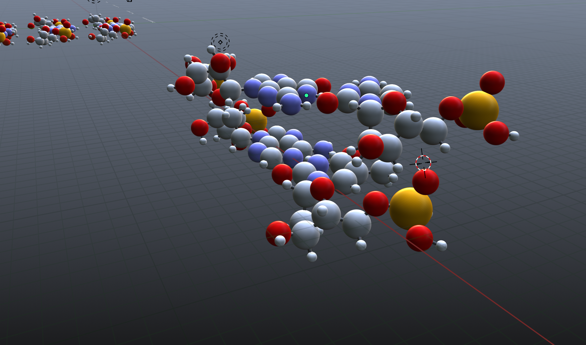
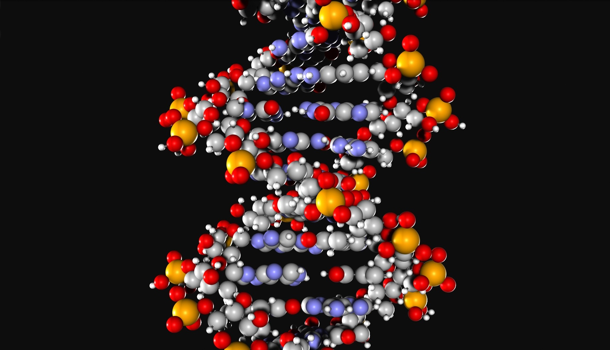

# Bioinformatics
Bioinformatics with Python and Blender 3D  
 
This project is related to DNA 3D Data visualization, using Blender, Python.
My goal is to reproduce 3D rapresentation of a DNA Sequence from a Json file containg molecules data and txt file containing DNA sequence, but with litle upgrade you can extract data from DB source o other.

  

